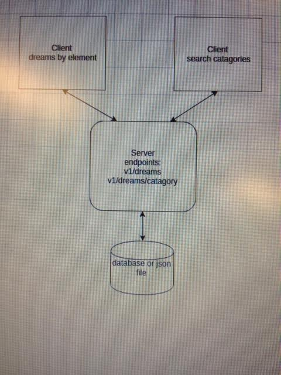

# Dream-interpretation

##Dream interpretation website, (Note: dream interpretation is complete tosh)

#Overview

In the browser the user can enter a basic theme/element from their dream, into the text field and click the button, a related image will appear on the left of the page, and a short explaination of what they theme/element might represent in their dream.

#Design outline

The client takes user entered data from a browser set up, hands it over to the server.  The server then uses that data to perform operations on a database to retreive more data and then returns it to the client, the client then displays it to  a browser

##Endpoints

#### return dream analysis from a database (json file)

GET /dreams

Using a query string obtained from the user input, the GET method will return a dream analysis stored in the json file 

