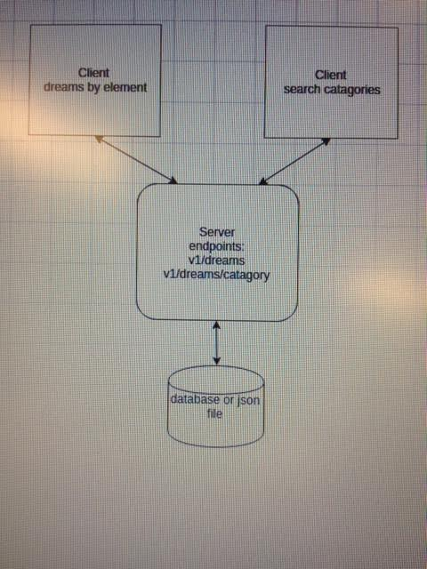
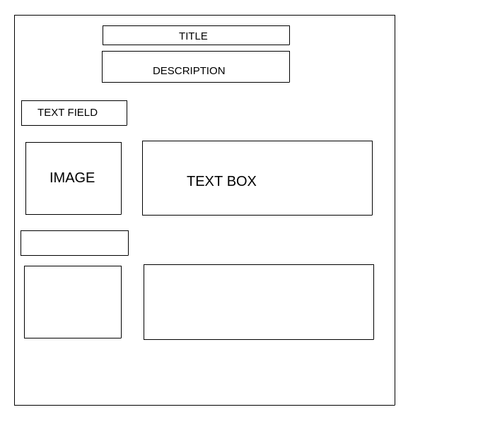
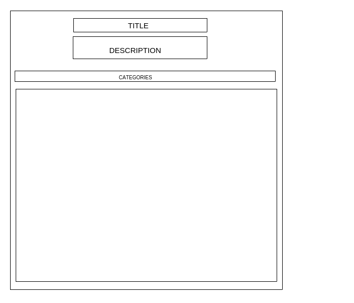

# Dream-interpretation

###Dream interpretation website, (Note: dream interpretation is complete tosh)

##Overview

In the browser the user can enter a basic theme/element from their dream, into the text field and click the button, a related image will appear on the left of the page, and a short explaination of what they theme/element might represent in their dream.

##Design outline

The client takes user entered data from a browser set up, hands it over to the server.  The server then uses that data to perform operations on a database to retreive more data and then returns it to the client, the client then displays it to  a browser

##Server

###Endpoints

####return dream analysis from a database (json file)

GET /dreams

Using a query string obtained from the user input, the GET method will return a dream analysis stored in the json file 

#### search catagories of dream elements

GET /dreams/catagory\

select a catagorie of elements by letter and review the analysis

###APIs
I will be using an API for an image site such as flickr, to import a picture to the browser when user input is found

##Client

###Client - Server interaction
The client is a browser and the client uses hypertext to display the seleted information to the browser. 

###GUI
The skeleton is set up in HTML and the client uses hyper text to display diffrent elements of the page 

home page

seach by category page 

##Stretch Elements

If i have time to add more elements I want to add a feature where, when the user adds an element some radio buttons appear with some more choices which can be used to sort a more detailed analysis. Accomplished by adding another layer to the json object

